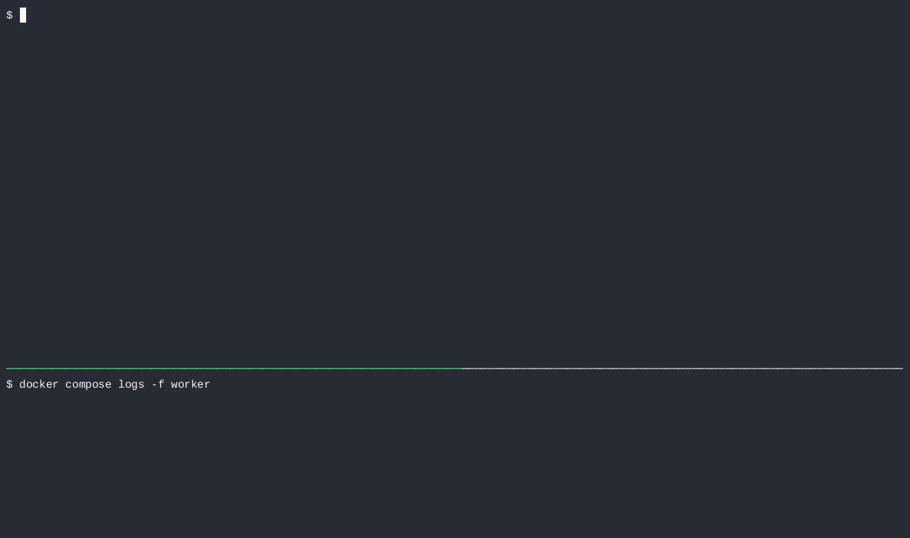
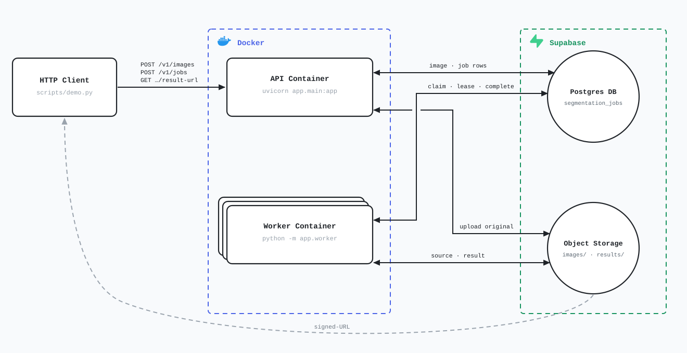

# segmentation-api

REST API for asynchronous image segmentation — multi-tenant, containerized, and tested end to end.

Clients upload a PNG, ask for it to be segmented, and poll until a result is ready. The API and the
workers are **separate containers that scale independently**: segmentation is CPU-bound C++ and runs
in a worker process pool, never on the API's event loop. Workers pull jobs from a Postgres-backed
job queue with atomic claims, leases and retries.

The segmentation engine is [segmentation-core](https://github.com/adrianfco/segmentation-core),
a companion C++/pybind11 library I also wrote.

**Stack:** Python 3.12 · FastAPI · Pydantic v2 · SQLAlchemy 2.0 (async) + psycopg 3 · PostgreSQL ·
Alembic · Supabase Storage · Docker · pytest + testcontainers · ruff · GitHub Actions

[](https://github.com/adrianfco/segmentation-api/actions/workflows/ci.yml)

---

## Demo

`scripts/demo.py` drives the whole pipeline against a running stack — upload → job → poll → download —
printing every HTTP request and response as it goes.



```
$ python scripts/demo.py $API_KEY     # transcript abridged

> POST /v1/images file=example.png (image/png)
< 201 {"id":"6af0eaa6-10a9-4419-8765-b7334f7f40e8","filename":"example.png","created_at":"2026-09-19T18:04:11Z"}

> POST /v1/jobs {"image_id": "6af0eaa6-10a9-4419-8765-b7334f7f40e8", "params": {"algorithm": "kmeans", "k": 6, "max_iters": 50}}
< 202 {"id":"c1d9e3b7-...","status":"queued","params":{"algorithm":"kmeans","k":6,"max_iters":50,"seed":812394417},...}

> GET /v1/jobs/c1d9e3b7-...
< 200 {"id":"c1d9e3b7-...","status":"running",...}

> GET /v1/jobs/c1d9e3b7-...
< 200 {"id":"c1d9e3b7-...","status":"succeeded","error_message":null,...}

> GET /v1/jobs/c1d9e3b7-.../result-url
< 200 {"url":"https://...supabase.co/storage/v1/object/sign/...","expires_at":"2026-09-19T18:14:29Z"}

Downloaded 284713 bytes -> scripts/segmented-example.png
```

| Input | Segmented (k=6) |
| --- | --- |
|  |  |

---

## Architecture



The API and the worker are **the same image with two entrypoints**, scaled independently:

1. `POST /v1/images` validates the upload (magic bytes, size cap), writes the object to Supabase Storage, then the row to Postgres.
2. `POST /v1/jobs` writes a `queued` row and returns `202` immediately — the request never waits on compute.
3. A worker **claims** the oldest claimable job with `SELECT … FOR UPDATE SKIP LOCKED`, takes a time-bounded lease, and runs segmentation in a subprocess pool.
4. On success it uploads the result and flips the job to `succeeded`; a reported failure records `error_message` and is terminal, while a worker that dies without answering has its lease expire and the job reclaimed — up to `JOB_MAX_ATTEMPTS`.
5. `GET /v1/jobs/{id}/result-url` hands back a short-lived signed URL — the image bytes never flow back through the API.

Where the load-bearing parts live:

| | |
| --- | --- |
| [`app/core/queue.py`](app/core/queue.py) | Job claim via `SELECT … FOR UPDATE SKIP LOCKED`, with leases, bounded retries, and status-guarded completion |
| [`app/worker.py`](app/worker.py) | Poll loop and `ProcessPoolExecutor` — segmentation-core holds the GIL, so threads would not parallelize |
| [`app/core/security.py`](app/core/security.py) | Hashed API keys; `/v1` mounted behind a single auth dependency, every query team-scoped |
| [`app/schemas/jobs.py`](app/schemas/jobs.py) | Per-algorithm job params as a Pydantic discriminated union |
| [`tests/test_queue.py`](tests/test_queue.py) | Concurrency and lease-expiry tests against a real Postgres 16 container |

---

## API

All `/v1` routes require an `X-API-Key` header. Lists are `limit`/`offset` paginated and newest-first.

| Method | Path | Purpose |
| --- | --- | --- |
| `GET` | `/health` | Liveness probe (public) |
| `POST` | `/v1/images` | Upload a PNG → `201` |
| `GET` | `/v1/images` | List the team's images |
| `GET` | `/v1/images/{id}` | Image detail |
| `GET` | `/v1/images/{id}/download-url` | Signed URL for the original |
| `POST` | `/v1/jobs` | Enqueue a segmentation job → `202` + `Location` |
| `GET` | `/v1/jobs?status=&image_id=` | List jobs, filterable |
| `GET` | `/v1/jobs/{id}` | Job detail — poll this |
| `GET` | `/v1/jobs/{id}/result-url` | Signed URL for the result, `409` unless `succeeded` |

Errors return `{"detail": "..."}`: `401` unauthenticated, `404` not found *or not yours*, `409` wrong
job state (the detail names the current status), `413` too large, `415` not a PNG, `422` invalid
params, `502` storage unavailable.

Interactive OpenAPI docs are served at `/docs`.

---

## Running it

**Requirements:** Docker, and a [Supabase](https://supabase.com) project (Postgres + a private
storage bucket). No C++ toolchain is needed — segmentation-core ships prebuilt wheels.

```bash
cp .env.example .env          # fill in DATABASE_URL, SUPABASE_URL, SUPABASE_SERVICE_ROLE_KEY
pip install -e ".[dev]"       # migrations, admin CLIs and the demo run from the host

alembic upgrade head
python -m tools.create_team demo
python -m tools.create_api_key demo local
# → Key (store this now, it will not be shown again): <raw key>

docker compose up --build     # API on :8000, plus a worker — same image, two entrypoints
python scripts/demo.py <raw key>
```

The runtime image ships only the application package. Migrations, admin tooling and tests are
operator concerns that talk to Supabase directly, so they stay out of the container.

<details>
<summary>Running it without Docker</summary>

```bash
uvicorn app.main:app --reload     # terminal 1
python -m app.worker              # terminal 2
```
</details>

**Tests** (the queue tests need a Docker daemon for testcontainers):

```bash
pytest
ruff format --check . && ruff check .
```

---

## Project layout

```
app/
  main.py          FastAPI entrypoint
  worker.py        Worker entrypoint — claim → segment → upload
  core/            Cross-cutting infra: config, db, security, storage, queue
  models/          SQLAlchemy 2.0 models (Team, ApiKey, Image, SegmentationJob)
  routers/         HTTP layer; /v1 mounted behind the auth dependency
  schemas/         Pydantic request/response contracts
alembic/           Migrations
tools/             Admin CLIs: create_team, create_api_key
scripts/demo.py    End-to-end demo against a running stack
tests/             138 tests — unit + real-Postgres integration
```

## License

MIT
